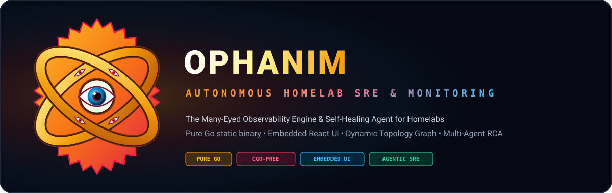

<div align="center">



# Ophanim: Homelab Autonomous SRE & Monitoring System

[](https://golang.org)
[](https://golang.org)
[](https://hub.docker.com)
[](https://react.dev)
[](https://tailwindcss.com)
[](LICENSE)

*The All-Seeing Autonomous Observability & Self-Healing Agent for Homelabs*

</div>

---

## ✨ Key Features

- **🚀 Zero-Friction Dual Deployment**:
  - **Ophanim Hub**: Single static binary or 1-liner host-mode Docker container with embedded web UI and zero external database dependencies (Pure Go SQLite).
  - **Ophanim-Monitor**: Ultra-lightweight edge probe (<10MB RAM) for secondary nodes with instant 1-click token enrollment.
- **🔌 Pluggable Ingestion (Ophanim-Monitor OR Prometheus)**:
  - Stream native real-time telemetry from `ophanim-monitor` edge agents.
  - **OR** scrape standard Prometheus `/metrics` endpoints (`node_exporter`, `cAdvisor`, Traefik) and query Prometheus/VictoriaMetrics servers via PromQL.
- **🗺️ Interactive Homelab Dependency Topology**:
  - Live visual dependency graph mapping proxies, containers, databases, and physical hosts.
  - Dynamic root-cause candidate identification and cascading impact tracking.
- **🚨 Topology-Aware Anomaly Correlation & Anti-Flapping**:
  - Suppresses cascading alert storms (e.g. database crash grouping 10 downstream 502s into a single Incident Thread).
- **🤖 Agentic Root Cause Analysis (RCA)**:
  - LLM-powered incident diagnosis (Gemini, Claude, OpenAI, or local Ollama/vLLM) with historical Incident RAG memory.
- **💬 Multi-Platform ChatOps**:
  - **Discord Bot**: Rich embed alert cards, dedicated incident threads, and 1-click action buttons (`[Approve Fix]`, `[View Logs]`, `[Ignore]`).
  - **Telegram Bot**: Inline keyboard callback buttons and topic routing.
  - **Webhooks**: High-priority push notifications to NTFY or Pushover.
- **🛡️ Guardrailed Self-Healing & Security Hardened**:
  - Typed action primitives (`ContainerRestart`, `ContainerStop`, `ContainerStart`), per-container rate limiters (max 2 restarts/hr), cascading failure circuit breakers, and post-fix 3-step verification loops.
  - Security headers, non-root container user, read-only Docker socket integration, and auth capability hooks.
- **📱 Responsive Modern Web UI**:
  - Built with React, Tailwind CSS, Lucide icons, and dark-mode aesthetic, embedded directly into the Go binary.

---

## 📦 Quick Start

### Option A: Run with Docker Compose (Host Mode)
```yaml
# docker-compose.yml
services:
  ophanim:
    image: ophanim:latest
    container_name: ophanim
    restart: unless-stopped
    network_mode: host
    volumes:
      - /var/run/docker.sock:/var/run/docker.sock:ro
      - ophanim-data:/data
      - ./config.yaml:/etc/ophanim/config.yaml:ro
    environment:
      - OPHANIM_CONFIG=/etc/ophanim/config.yaml
      - OPHANIM_DB_PATH=/data/ophanim.db

volumes:
  ophanim-data:
```

```bash
docker compose up -d
```

Open `http://<your-server-ip>:8085` to access the Ophanim Web Dashboard.

---

### Option B: Run as Standalone Go Static Binary
```bash
# 1. Build or download binary
make all

# 2. Run Ophanim Hub
./bin/ophanim --port 8085 --db data/ophanim.db
```

---

## 📡 Enrolling Secondary Nodes (`ophanim-monitor`)

In the Web UI, click **"ADD DEVICE"** to generate a 1-click pairing token, then run on your secondary node:

```bash
docker run -d \
  --name ophanim-monitor \
  --restart unless-stopped \
  --network host \
  -v /var/run/docker.sock:/var/run/docker.sock \
  -e OPHANIM_HUB_URL=http://<hub-ip>:8085 \
  -e OPHANIM_ENROLL_TOKEN=oph_tok_xxx \
  ophanim-monitor:latest
```

---

## 🛠️ Configuration (`config.yaml`)

```yaml
hub:
  listen_addr: "0.0.0.0"
  port: 8085
  poll_interval: 10s
  retention_days: 30

storage:
  db_path: "data/ophanim.db"
  ring_buffer_lines: 1000

llm:
  enabled: true
  provider: "gemini" # gemini, claude, openai, ollama
  model: "gemini-2.5-flash"
  api_key: "${GEMINI_API_KEY}"

chatops:
  discord:
    enabled: false
    bot_token: "${DISCORD_BOT_TOKEN}"
    alert_channel_id: "123456789"
  telegram:
    enabled: false
    bot_token: "${TELEGRAM_BOT_TOKEN}"
    chat_id: 123456789

thresholds:
  cpu_critical_percent: 95.0
  memory_critical_percent: 95.0
  disk_critical_percent: 92.0
  auto_heal_max_per_hour: 2
  anti_flap_window: 5m
```

---

## 🧪 Testing

```bash
# Run all unit and integration tests
go test -v ./pkg/...
```

---

## 📄 License
MIT License. Built for the Homelab community.
